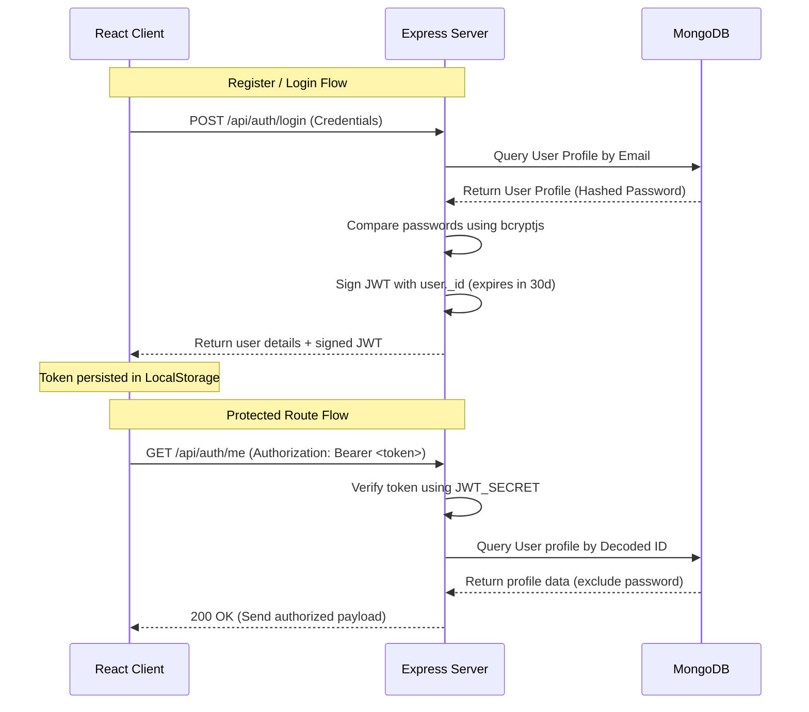

# 🛡️ AURA // MERN Stack Authentication Boilerplate

[](https://reactjs.org/)
[](https://nodejs.org/)
[](https://www.mongodb.com/)
[](https://expressjs.com/)
[](https://vitejs.dev/)
[](https://opensource.org/licenses/MIT)

A state-of-the-art, production-ready MERN (MongoDB, Express, React, Node.js) authentication boilerplate. Engineered with absolute security, clean MVC architecture, and styled in a premium **True Black Crystal Theme** featuring glassmorphism elements, custom animations, and a centered layout.

---

## 🎨 Visual Design System: True Black Crystal Theme

The interface is built with a minimalist, high-fidelity dark aesthetic. It eschews generic dark grays for a true `#000000` pitch-black canvas, overlaying glassmorphic panels and crisp white typographic elements.

### Design Tokens (`src/index.css`)

| Token | CSS Variable | Value | Description |
| :--- | :--- | :--- | :--- |
| **Canvas Background** | `--bg-black` | `#000000` | True-black base background |
| **Glass Card Background** | `--card-bg` | `rgba(10, 10, 10, 0.8)` | Minimal translucent black card |
| **Card Blur** | `backdrop-filter` | `blur(24px)` | Premium backdrop blur |
| **Fine Borders** | `--border-light` | `rgba(255, 255, 255, 0.08)` | Ultra-thin border strokes |
| **Active Focus States** | `--border-focus` | `rgba(255, 255, 255, 0.3)` | Glowing focus borders |
| **Primary Typography** | `--text-primary` | `#ffffff` | Pure white content text |
| **Secondary Typography**| `--text-secondary` | `#a0a0a5` | Muted silver descriptions |

---

## ⚡ Key Features

### Backend Security (Express & Node.js)
- **MVC Architecture**: Separated concerns across `models`, `controllers`, `routes`, and `middleware`.
- **Password Hashing**: Automatic pre-save hashing using `bcryptjs` (rounds: `10`).
- **JWT Authentication**: High-security session tracking with 30-day expiration token validation.
- **Secure Middleware**: Global Bearer Token route protector (`protect`) mapping user context to request headers.
- **Robust Exception Handling**: Custom JSON 404 and 500 error handlers to suppress raw Stacktraces in production.

### Frontend Experience (React + Vite)
- **Global Auth Context**: Global state provider (`AuthContext`) managing logins, sign-ups, loader triggers, and API responses.
- **Persistent Sessions**: Automatic credential recovery and session checks on page refresh via local token verification.
- **Security Route Guards**: Dedicated `<ProtectedRoute />` wrapper preventing guest views of private pages.
- **Responsive Layout**: Fluid centered alignment with floating form components optimized for mobile and desktop viewports.
- **User Interface Details**: Minimalist styling, Lucide icons, password-reveal visibility toggles, and animated alert panels.

### Development Utilities
- **One-Command Setup**: Concurrent executions of frontend and backend environments from the root folder.
- **Vite Proxy Configuration**: Pre-set `/api` dev proxy routing frontend requests to `localhost:5000` to prevent CORS issues.

---

## 📂 Project Directory Structure

```
MERN-Auth-Boilerplate/
├── package.json              # Orchestrates installation and concurrent runners
├── package-lock.json
├── .gitignore                # Configured to ignore node_modules, build targets & .env
├── backend/
│   ├── .env                  # Port, MongoDB URI, and JWT Secret settings
│   ├── server.js             # Express app entry, middleware mounts, and error handlers
│   ├── package.json          # Node.js backend dependencies
│   ├── config/
│   │   └── db.js             # Mongoose database client connection handler
│   ├── controllers/
│   │   └── authController.js # Auth operations (register, login, me)
│   ├── middleware/
│   │   └── authMiddleware.js # Token authentication guard
│   ├── models/
│   │   └── User.js           # User database schema & helper methods
│   └── routes/
│       └── authRoutes.js     # Express routes endpoints declarations
└── frontend/
    ├── index.html            # Imports Google Fonts Outfit & Plus Jakarta Sans
    ├── package.json          # React, Axios, React Router, and dev dependencies
    ├── vite.config.js        # React plugin and CORS dev API proxy configurations
    └── src/
        ├── main.jsx          # React DOM mounting bootstrap
        ├── App.jsx           # App layout boundaries and routes tree
        ├── index.css         # Styling system (True Black Crystal Theme)
        ├── components/
        │   ├── Navbar.jsx    # Glass header showing session options
        │   └── ProtectedRoute.jsx # Authentication route guard
        ├── context/
        │   └── AuthContext.jsx    # Auth state container & Axios setup
        └── pages/
            ├── Dashboard.jsx # Authenticated user dashboard & JWT inspector
            ├── Login.jsx     # Login form card
            └── Register.jsx  # Register form card
```

---

## ⚙️ Environment Variables Setup

Create a `.env` file in the `/backend` folder.

```env
PORT=5000
MONGO_URI=mongodb://127.0.0.1:27017/mern_auth_boilerplate
JWT_SECRET=your_super_secure_random_jwt_secret_key_change_me
NODE_ENV=development
```

---

## 🚀 Installation & Getting Started

### Prerequisites
- [Node.js](https://nodejs.org/en) (v18+ recommended)
- [MongoDB](https://www.mongodb.com/try/download/community) running locally or an Atlas connection string

### Setup Instructions

1. **Clone the Repository:**
   ```bash
   git clone https://github.com/your-username/mern-auth-boilerplate.git
   cd mern-auth-boilerplate
   ```

2. **Install Dependencies (Root, Client, and Server):**
   We provide an automation command in the root `package.json` to pull dependencies for all workspaces at once:
   ```bash
   npm run install-all
   ```

3. **Start Development Servers:**
   Boot up both the React dev client and the Node.js Express server concurrently using a single command:
   ```bash
   npm run dev
   ```

4. **Verify Application status:**
   - **Frontend Console**: Available at `http://localhost:5173`
   - **Backend API Server**: Healthcheck checks available at `http://localhost:5000/api/health`

---

## 🔒 Security Architectures & Protocols



---

## 📝 License

Distributed under the MIT License. See `LICENSE` for more information.

---

## ⭐ Support & Contribute

If this boilerplate helped you speed up your project setup, please consider giving it a star!

*   **Star this repository** to show support.
*   **Fork the project** to add custom security modules.
*   Submit **Pull Requests** for optimizations (e.g. CSRF tokens, Cookie-based token setups).

Developed with ❤️ by the community. Keep building securely!
